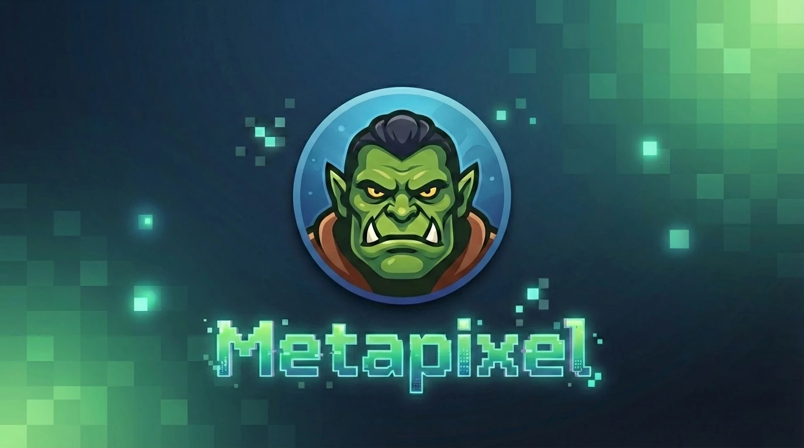

# Metapixel



[](https://www.python.org/downloads/)
[](https://opensource.org/licenses/MIT)

**Metapixel** is an intelligent tool that understands the colors in your images. 

Whether you are a designer looking for the perfect palette or a developer building a search engine based on color, Metapixel uses computer vision to extract, name, and categorize the dominant colors in any digital asset.

## ✨ Why Metapixel?

Most color pickers give you a hex code. Metapixel gives you **context**. 
- **Automated Extraction:** No more manual sampling.
- **Semantic Naming:** Instead of `#000080`, get "Navy Blue".
- **Visual Verification:** Instantly see the palette compared against your original image.

## 🚀 Quick Start

### 1. Installation
Install the package directly from the repository:

```bash
pip install .
```

### 2. Extract Colors
Run it on any image to see the top 5 dominant colors:

```bash
metapixel image.png
```

## 🛠️ Key Features

### Color Palette Generation
Extract up to any number of dominant colors using K-Means clustering.
```bash
metapixel photo.jpg --colors 8
```

### Side-by-Side Visualization
Generate a comparison image to see how the extracted palette matches the original art.
```bash
metapixel photo.jpg --visualize
```

### Developer-Friendly Output
Need to pipe this into another tool? Metapixel supports JSON and CSV.
```bash
metapixel logo.png --output json
```

## 📋 Command Line Interface

| Option | Command | Description |
| :--- | :--- | :--- |
| **Colors** | `-k` or `--colors` | Number of colors to find (Default: 5) |
| **Output** | `-o` or `--output` | Choose `text`, `json`, or `csv` |
| **Visual** | `-v` or `--visualize` | Creates `metapixel_viz.png` |

## 🏗️ Project Structure

- `metapixel/`: The core engine and color database.
- `pyproject.toml`: Simple installation management.
- `docs/assets/`: Visual documentation assets.

---
Built with passion by **World of Unreal**.
